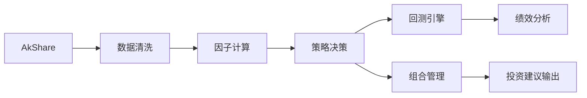
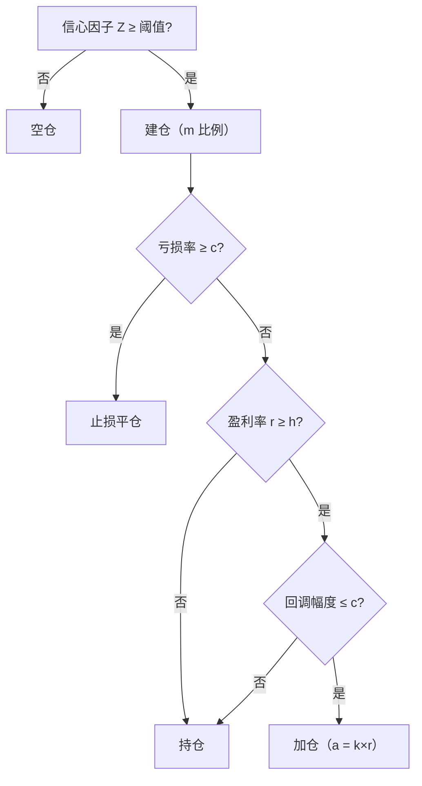

# 项目概述

基于 Python + AkShare 的 A 股量化投资系统，面向单人使用。

| 属性 | 说明 |
|------|------|
| 资金规模 | 1k – 100 万人民币 |
| 资产范围 | 沪深 A 股股票、公募基金 |
| 交易频率 | 日线级（非高频） |
| 执行方式 | 仅输出建议，手动下单 |
| 核心策略 | Livermore 原则：**浮亏不加仓、盈利加仓** |
| 绩效指标 | 收益率、夏普比率、最大回撤、波动率 |
| 合规框架 | 遵守证监会及沪深交易所程序化交易规定 |

# 系统架构

各模块职责及数据流：



| 模块 | 职责 |
|------|------|
| 数据接入 | AkShare 拉取股票行情、基金净值，支持重试与本地缓存 |
| 数据清洗 | 停牌填充、复权、异常值过滤、交易日对齐 |
| 因子计算 | MA/EMA/MACD/RSI/布林带/动量/量比，合成信心因子 Z |
| 策略决策 | Livermore 建仓 / 止损 / 加仓规则，输出交易信号 |
| 组合管理 | 多标的权重优化（等权 / 风险平价） |
| 回测引擎 | 模拟历史交易，计算净值曲线与绩效指标 |
| 结果输出 | 生成交易建议与绩效报告 |

# 技术选型

| 分类 | 选用方案 | 说明 |
|------|----------|------|
| 语言 | Python | 量化生态成熟（Pandas / NumPy / TA-Lib） |
| 数据接口 | AkShare | 免费、覆盖 A 股与基金，调用有频率限制 |
| 数据存储 | Parquet 文件 + SQLite | 行情数据用 Parquet，配置/日志用 SQLite |
| 机器学习 | Scikit-Learn / LightGBM | 辅助预测趋势，按需引入 |
| 容器化 | Docker | 保证环境一致性，支持 Cron 定时任务 |
| CI/CD | GitHub Actions | checkout → 安装依赖 → pytest → flake8 |
| 敏感配置 | 环境变量 | 凭证不入代码仓库 |

# 数据规范

**数据来源**：仅使用 AkShare 接口，覆盖沪深 A 股日线行情与公募基金净值。

**清洗规则**：
- 停牌缺失：前值填充（ffill）
- 复权方式：前复权（qfq）
- 异常值：单日涨跌幅超过阈值的行标记后前填充
- 有效性：不足 60 个交易日的标的直接过滤

**回测费率模型**：

| 费用类型 | 数值 |
|----------|------|
| 股票佣金（双边） | 0.03% |
| 滑点 | 0.02% |
| 印花税（卖出） | 0.1% |
| 基金申购费 | 1.5% |

# Livermore 策略规则

**参数说明**：

| 参数 | 含义 | 配置键 |
|------|------|--------|
| *m* | 初始建仓比例（占总资金） | `livermore.m` |
| *c* | 止损 / 回调阈值 | `livermore.c` |
| *h* | 加仓解锁盈利阈值 | `livermore.h` |
| *k* | 加仓系数，$a = k \times r$ | `livermore.k` |
| *Z* | 信心因子（多因子合成） | `signal.confidence_threshold` |

**决策流程**：



**资金不足时（Y 因子）**：按盈利率从低到高排序，依次卖出持仓最差的标的以补足资金后再建仓 / 加仓。

**风险指标**：回测输出收益率、夏普比率、最大回撤、年化波动率，基准为沪深 300（000300）。

# 因子体系

| 类别 | 因子 |
|------|------|
| 均线 | MA(5/10/20/60)、EMA(12/26) |
| 趋势 | MACD(DIF/DEA/柱)、布林带(20,2σ) |
| 动量 | ROC、N 日收益率(5/10/20) |
| 量价 | 成交量均线、量比 |
| 综合 | 信心因子 Z（上述因子滚动标准化等权合成） |

# 开发规范

**分支模型**：GitHub Flow — `main` 保持可部署，功能在 `feature/*` 分支开发，发布打 Tag。

**测试要求**：
- 单元测试（pytest）：覆盖因子计算、策略决策、回测逻辑的边界与异常情况
- 集成测试：用标准测试数据集做端到端回测验证
- 代码检查：flake8 静态检查，所有测试通过后方可合并

**可复现性**：固定随机种子，行情数据与参数纳入版本控制。

# 部署与运维

- **运行环境**：Docker 容器，每日收盘后 Cron 触发数据更新
- **监控**：记录每日回测损益、脚本异常，邮件 / 钉钉告警
- **合规**：全量审计日志（时间戳、信号类型、因子值、价格、金额），只追加写入，支持事后回溯

# 合规要点

遵守证监会及沪深交易所量化交易规定，系统自动检测以下异常并发出警告：
- 单日建议频率过高
- 单标的资金集中度超限

# 里程碑

| # | 阶段 | 交付物 | 验收标准 |
|---|------|--------|----------|
| 1 | 需求与设计 | 系统设计文档 | 设计评审通过 |
| 2 | 数据与环境 | 清洗脚本、回测环境配置 | 示例数据成功清洗并可回测 |
| 3 | 核心策略 | Livermore 策略代码 | 历史回测符合预期收益/风险指标 |
| 4 | 辅助模型与优化 | 组合优化模块 | 回测结果优于基准 |
| 5 | 测试与 CI | 单元/集成测试、CI 配置 | 全部测试通过，流程自动化 |
| 6 | 文档与部署 | 用户手册、部署指南 | 系统稳定运行，无未文档功能 |

# 附录

## 目录结构

```
QMT_A6/
├── docs/               # 文档
├── configs/            # 配置文件（data_config.yaml、strategy_config.yaml）
├── datas/raw/          # 原始行情数据缓存
├── scripts/
│   ├── processed/      # 数据获取与清洗（fetch_data.py、clean_data.py）
│   ├── features/       # 因子计算（calc_features.py）
│   ├── strategy/       # 策略决策（livermore.py、signal_generator.py）
│   ├── backtest/       # 回测引擎
│   ├── portfolio/      # 组合优化
│   └── utils/          # 通用工具
└── tests/
    ├── unit/           # 单元测试
    └── integration/    # 集成测试
```

## 关键接口

```python
# 数据层
fetch_stock_price(symbol, start_date, end_date, adjust="qfq") -> DataFrame
fetch_fund_nav(fund_code, start_date, end_date) -> DataFrame
fetch_trade_calendar(start_date, end_date) -> list[str]

# 因子层
build_all_features(df) -> DataFrame  # 追加所有因子列

# 策略层
LivermoreStrategy().generate_signals(portfolio, prices, confidence_scores) -> list[dict]

# 回测层
run_backtest(strategy, capital, start_date, end_date) -> dict  # 净值曲线 + 绩效指标
```

## 参考链接

**合规**
- [上海证券交易所（SSE）](http://www.sse.com.cn)
- [深圳证券交易所（SZSE）](http://www.szse.cn)

**数据接口**
- [AkShare](https://akshare.akfamily.xyz) — 本系统指定数据接口

**Python 库**
- [Pandas](https://pandas.pydata.org)
- [NumPy](https://numpy.org)
- [Scikit-Learn](https://scikit-learn.org)
- [LightGBM](https://lightgbm.readthedocs.io)

**DevOps**
- [GitHub Actions](https://docs.github.com/actions)
- [Docker](https://www.docker.com)

**金融理论**
- [Sharpe Ratio（夏普比率）](https://en.wikipedia.org/wiki/Sharpe_ratio)
- [Modern Portfolio Theory（马科维茨组合理论）](https://en.wikipedia.org/wiki/Modern_portfolio_theory)
- [Risk Parity（风险平价）](https://en.wikipedia.org/wiki/Risk_parity)
