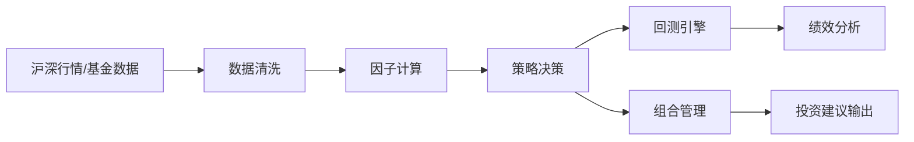
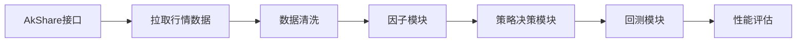

# 执行摘要  
本系统旨在基于Python和AkShare重构一个面向中国A股股票与公募基金的量化投资系统。资金规模1k–100万人民币，面向单人使用，仅提供交易建议，不自动下单，非高频（日线级）。策略核心遵循Livermore原则：**浮亏不加仓、盈利加仓**，具体包括以比例*m*建仓、亏损达到*c*止损、盈利超过*h*后触回调≤*c*加仓等规则（详见策略逻辑）。成功标准为策略表现符合预期（收益风险指标）、系统稳定可靠且合规。风险与合规要点：严格遵守证监会及交易所程序化交易管理规定（参见上交所、深交所公告），对异常交易行为设置检测与限制，并全面记录审计日志。  

# 系统总体设计  
系统采用模块化架构，主要模块包括：  

- **数据接入**：通过AkShare接口从沪深交易所获取股票行情、基金净值等数据（可参考上交所/深交所官方说明）。  
- **数据清洗与处理**：对原始数据进行清洗（处理停牌、缺失值、价格复权等）并按交易日对齐。  
- **因子计算**：计算各类技术指标和自定义因子，如均线、动量、成交量指标等。  
- **策略决策**：基于Livermore决策规则和其他备选模型生成交易信号；核心决策树见下节。  
- **组合管理**：在多策略并行时进行组合优化与风控（如均值-方差或风险平价优化）。  
- **回测引擎**：接收交易信号模拟历史回测，计算绩效及风险指标。  
- **结果输出**：生成交易建议和绩效报告，供用户决策。  

模块间数据流清晰：数据→清洗→因子→策略→回测→绩效。接口与依赖：各模块通过函数或轻量API交互，依赖AkShare数据、Pandas数据框等。系统可扩展性强：支持新增因子、策略和资产；可将系统部署在多核或云环境以应对计算需求。容错策略包括：关键步骤日志记录、失败重试、检查点保存等，保证运行稳定。  

*Mermaid图示例（系统数据流）*：  


# 技术栈与架构选型理由  
- **后端语言**：仅使用Python，因其量化生态成熟（Pandas、NumPy、TA-Lib、Zipline等）且易于开发与维护。  
- **数据存储**：使用轻量关系型数据库（如SQLite/MySQL）存储配置和交易日志；历史行情和因子数据可存为CSV/Parquet文件或使用Pandas DataFrame处理；缓存热点数据可用Redis。  
- **实时/批处理**：系统以日线数据为主，无需实时流处理。AkShare按日拉取历史行情并更新数据。批量回测采用Pandas进行运算，无需大数据框架。  
- **模型训练与推理**：可选用Scikit-Learn、LightGBM等常用机器学习框架；深度学习需求较低。训练可在单机CPU/GPU完成，推理集成在策略模块内。  
- **容器化与部署**：建议使用Docker打包应用和依赖，确保环境一致性。部署可选用Docker Compose或轻量Kubernetes进行编排，但对于单人项目也可采用云服务器直接部署。  
- **CI/CD**：利用GitHub Actions或GitLab CI自动化测试和部署。典型流程：`checkout`→安装依赖→运行单元/集成测试→代码格式检查→（可选）构建并部署。这样可保证每次提交前后自动验证代码正确性。  
- **安全与权限**：系统不涉及交易账户，仅内部部署，无开放API。需做好代码审查避免安全漏洞。敏感数据（如配置凭证）通过环境变量或加密存储。内部服务间通信使用HTTPS。  

*选型对比表（示例）*：

| 功能         | 技术选项                 | 优点                           | 缺点                             |
|------------|------------------------|------------------------------|----------------------------------|
| 数据接口     | **AkShare (Python)**      | 免费、支持A股行情与基金数据【14†L10-L18】【21†L20-L27】 | 调用率受限，需自行清洗             |
|            | Wind/同花顺（商业API）   | 数据全面、质量高                | 费用高、限制严格                  |
| 数据存储     | SQLite/MySQL           | 结构化查询快、易备份            | 对海量K线不够高效                 |
|            | CSV/Parquet文件        | 简单易用、可存大规模数据         | 不支持复杂查询                    |
| 实时处理     | Python脚本定时拉取       | 开发简单、易调试               | 延迟较高，不支持秒级响应           |
|            | Kafka/RabbitMQ         | 高并发、实时性好               | 部署和维护成本高                   |
| 模型框架     | Scikit-Learn/LightGBM | 易用、社区成熟                 | 对极大数据集处理有限               |
|            | PyTorch/TensorFlow   | 支持复杂神经网络、高并行       | 学习曲线陡峭、部署复杂             |
| CI/CD工具  | GitHub Actions       | 集成方便、支持矩阵测试           | 免费额度有限（可扩展付费）        |
|            | Jenkins/GitLab CI    | 灵活自托管、无限制             | 需要额外服务器资源，配置复杂        |

# 数据源与接入  
- **官方数据源**：参考上交所、深交所提供的基本数据（交易日历、指数行情等）【5†L69-L77】【9†L39-L47】。使用AkShare调用交易所API获取沪深股市行情。公募基金数据可通过AkShare调用基金净值接口。  
- **第三方数据**：可参考Wind、聚宽、米筐、同花顺等平台（但实际系统仅用AkShare接口）。聚宽JQData提供2005~至今全A股行情【14†L10-L18】，米筐RQData可获取多资产行情。  
- **历史与实时**：回测使用历史日线数据（含开高低收、成交量、复权因子；基金使用净值历史）。实盘建议在交易日结束后更新数据，无需分钟级。  
- **数据清洗**：包括填补停牌缺失（如使用前值或前复权价）、计算复权价格、去除异常值等。确保回测输入数据一致、完整。  
- **回测基准**：设定统一的回测规范：使用同一交易日历和数据频率，采用固定的手续费滑点模型。例如股票交易可假设双边0.03%手续费、滑点0.02%，基金申购费1.5%。所有策略在相同规则下评估性能。  

*数据源对比表（示例）*：

| 数据源       | 覆盖资产         | 可获取数据                         | 建议用途                      |
|------------|----------------|-------------------------------|-----------------------------|
| 交易所API    | A股股票         | 实时/历史行情、指数、分笔             | 官方权威数据，延迟低            |
| 聚宽JQData  | A股、基金       | 历史行情、财务指标、行业概念         | 回测数据源（付费），接口易用【14†L10-L18】 |
| 米筐RQData  | A股、基金、期货等 | 多资产历史行情、因子数据             | 综合量化平台数据（付费）         |
| AkShare/Tushare | A股、基金    | 公共行情、资金流向、板块等            | 免费开源，用于抓取历史和实时数据 |
| Wind/同花顺   | A股、基金、全球 | 全市场专业数据、实时行情、财务、研报    | 商业终端数据，用于高质量研究      |

*Mermaid图示例（数据流）*：  


# 模型与策略框架  
- **候选模型**：包括动量策略、均值回归、多因子线性模型、机器学习模型等。策略以简洁、解释性强为原则，辅助使用LightGBM等模型预测趋势。  
- **特征工程**：构造价格技术指标（移动平均、MACD、RSI等）、成交量/换手率因子、板块轮动指标及宏观指标。也可使用基本面因子（市盈率、盈利增长等）。  
- **风险管理**：实时监控组合的风险指标，如波动率、VaR、最大回撤等，设置动态止损。使用夏普比率（Sharpe Ratio）等指标评估表现【34†L19-L21】。  
- **组合优化**：若同时运行多策略或多资产，采用均值-方差或风险平价方法优化权重。可参考马科维茨现代投资组合理论【33†L78-L82】与风险平价思想【33†L58-L64】。  
- **交易成本与滑点**：回测中模拟手续费、印花税和滑点成本（例如每笔按照市价偏离0.01%）。模型中可调整阈值抑制过度交易。  
- **Livermore策略决策树**：严格遵循以下步骤：  

  1. **入场（开仓）**：当因子信心Z达到阈值时，按比例*m*投入市值建立仓位。  
  2. **优胜劣汰（Y因子）**：若现金不足以完成当前加仓/建仓，则计算Y因子（如历史盈利率等），选择表现最差的持仓卖出以补足资金。  
  3. **止损**：任何持仓亏损≥*c*时，立即平掉此仓位。  
  4. **盈利加仓**：当前盈利率r超过阈值*h*后，若价格回调不超过*c*，执行加仓操作。加仓比例*a*与盈利率r线性相关，例如$a = k \times r$（其中$k$为用户设定常数），确保盈利仓位得到增强。  

  *Mermaid示意（策略逻辑）*：  
  ```mermaid
  flowchart TD
    Z["信心因子Z足够?"] -->|否| 空仓
    Z -->|是| 建仓[m比例]
    建仓 --> 盈利{"盈利率 r >= h?"}
    盈利 -->|否| 持仓
    盈利 -->|是| 解锁加仓
    解锁加仓 --> 回调{"回调幅度 <= c?"}
    回调 -->|是| 加仓[a ∝ r]
    回调 -->|否| 持仓
    建仓 --> 止损{"亏损 >= c?"}
    止损 -->|是| 止损平仓
  ```  

# 开发与测试流程  
- **分支策略**：采用GitHub Flow。主分支（main）保持可部署状态，功能开发在feature分支进行。发布前在release分支上做最后测试，并打Release Tag备份。  
- **代码审查**：所有合并请求（PR）需通过至少一名评审，重点检查逻辑正确性与性能。要求通过静态检查工具（如flake8）保证代码规范。  
- **单元测试**：使用pytest为关键模块（因子计算、策略决策、回测逻辑等）编写单元测试，覆盖边界条件和异常情况。  
- **集成测试**：设置测试数据集进行端到端回测，验证数据流和接口的正确交互。  
- **回测基准测试**：建立简单基准策略（如随机持仓或均线交叉）与系统回测结果对比，确保回测框架合理。  
- **可复现性**：固定随机种子，版本控制所有代码与数据。保持相同市场数据和参数，以保证回测结果可复现。  


# 部署与运维  
- **部署**：可部署在云服务器或本地Linux环境，建议使用Docker容器化运行环境。设置定时任务（Cron）每天获取并更新数据。  
- **监控与告警**：实时监控系统运行状态与指标，如每日回测损益、内存CPU使用。出现异常（如数据获取失败、脚本错误）时通过邮件/钉钉等通知。  
- **模型再训练**：设置定期（如季度）重新训练策略模型，或在策略表现下降时触发再训练。保留历史模型版本以备查。  
- **数据漂移检测**：监控关键因子分布和策略收益分布的变化。当检测到显著漂移时（如市场结构变化），触发告警并评估模型可靠性。  

# 合规、审计与日志  
- **交易合规要点**：遵守证监会、上交所和深交所的量化交易规定【5†L69-L77】【9†L39-L47】。禁止过快下单、频繁撤单等四类异常行为。系统自动监测交易建议频率和资金集中度，如超限则发出警告。  
- **审计日志**：记录所有交易建议和用户决策的详情：包括时间戳、策略名称、因子数值、信号类型（买/卖/平仓）、价格和资金占用等。日志采用只追加模式保存，支持事后审计和回溯。  
- **合规报告**：定期生成交易活动报告，如每日持仓、盈亏统计和风险指标。用户可通过报告检查系统输出是否符合内部和监管要求。  

# 迁移与版本管理  
- **迁移策略**：逐步将旧系统功能迁移到新系统架构中。可先在新架构中实现核心Livermore策略并验证，再依次移植其他策略逻辑。保证每步迁移都通过回测验证。  
- **里程碑规划**：按功能模块划分里程碑，每个里程碑结束时形成可演示版本。例如：数据模块完成、策略模块完成、整合测试完成等。  
- **版本控制与回滚**：每次发布前打Tag并备份，出现问题时可以回滚至上一个稳定版本。保持主分支的稳定性，使用release分支做最后测试。  

# 交付物清单与时间表  
- **建议里程碑**：  
  1. **需求与设计完成**：交付系统设计文档（模块图、流程图、参数说明等）。验收：设计评审通过。  
  2. **数据与环境搭建**：交付数据清洗脚本和回测环境配置。验收：示例行情数据成功清洗并回测测试策略。  
  3. **核心策略开发**：交付实现Livermore加仓策略的代码。验收：策略通过历史回测，符合预期收益/风险指标。  
  4. **辅助模型与优化**：交付其他备选策略或组合优化模块。验收：回测结果优于基准，性能合理。  
  5. **测试与CI流程**：交付完整的单元/集成测试和CI配置。验收：所有测试通过、自动化流程正常。  
  6. **文档与部署**：交付最终README、用户手册和部署指南。验收：系统稳定运行，无未文档功能。  
- **验收标准**：每项产出需通过代码审查、回测验证和功能测试。策略性能应达到预定指标（可用夏普比率、回撤等评估），文档齐全易读。  
- **工时与人力**：假设**开发团队规模与工时未指定**，可根据实际情况灵活配置，无特定约束。  

# 附录  

**示例目录结构（文本）**：  
```
/QuantSystem
│ 
├── docs/
│   ├── 设计文档.md
│   └── 用户手册.md
│   └──README.md
├── configs/
│   ├── strategy_config.yaml
│   └── data_config.yaml
│   └── config.json/ #各种json文件
├── datas/
│   ├── raw/        # 原始下载的数据
│   
├── scripts/
│   ├── processed/       # 数据获取与清洗模块
│   ├── features/   # 因子计算模块
│   ├── strategy/   # 策略与模型模块
│   ├── backtest/   # 回测引擎模块
│   ├── portfolio/  # 组合优化模块
│   └── utils/      # 通用工具函数
├── tests/
│   ├── unit/       # 单元测试
│   └── integration/ # 集成测试
└── scripts/        # 启动与部署脚本
```  

**关键接口示例说明**：  
- *数据接口*：例如`fetch_price(symbol, start, end)`方法说明：输入股票或基金代码及日期范围，输出清洗后的行情或净值时间序列。  
- *策略接口*：例如`generate_signals(features)`：接收因子数据，返回买/卖/止损信号。  
- *回测接口*：例如`run_backtest(strategy, capital, start_date, end_date)`：使用指定策略和初始资金运行回测，输出净值曲线和绩效指标。  

**CI/CD流程示例说明**：  
采用GitHub Actions示例：  
- **触发**：代码推送或合并Pull Request。  
- **步骤**：checkout代码→安装依赖→运行pytest进行测试→代码格式检查→（可选）打包镜像或部署到测试环境。  
- **验收**：所有测试通过且报告（例如Coverage）无异常。  

**常用Prompt模板示例**（用于Copilot）：  
- “请为以下Python函数生成完整注释：\n```python\ndef calculate_return(prices):\n    ...\n```”  
- “根据下面的描述，生成函数实现：‘计算资产列表的累计收益率’。”  
- “请为函数`generate_signals()`编写pytest单元测试。”  
- “审查以下策略代码并提出优化建议：\n```python\ndef strategy_logic(): ...\n```”  

**回测图示“代码”说明**：  
为了验证回测数据的有效性，可以编写一个绘制资金曲线的脚本。该脚本输入为回测输出（包含每日净值、持仓头寸、交易信号），输出为资金增长曲线图。通过观察资金曲线，可验证数据逻辑正确：例如资金曲线在止损或加仓点是否对应预期走势。该图表用于分析每笔交易行为的效果和策略表现。  

# 所有假设  
- **投资者规模**：单人用户或小团队（资金1k–100w人民币）。  
- **编程语言**：仅使用Python。  
- **数据接口**：仅使用AkShare。  
- **支持资产**：仅限沪深A股股票与公募基金，不含期货/期权。  
- **交易频率**：日线级或更低（非高频）。  
- **自动交易**：无，代码仅提供建议，由用户手动执行交易。  
- **开发团队**：人数、预算与工时未指定（无特定约束）。  
- **风险偏好**：未指定。  
- **部署环境**：可用Linux服务器或云环境，具体未指定（无特定约束）。  
- **合规框架**：参考中国证监会及交易所相关规则。  
- **数据完整性**：假设AkShare可获取所需历史行情与基金净值。