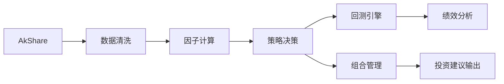
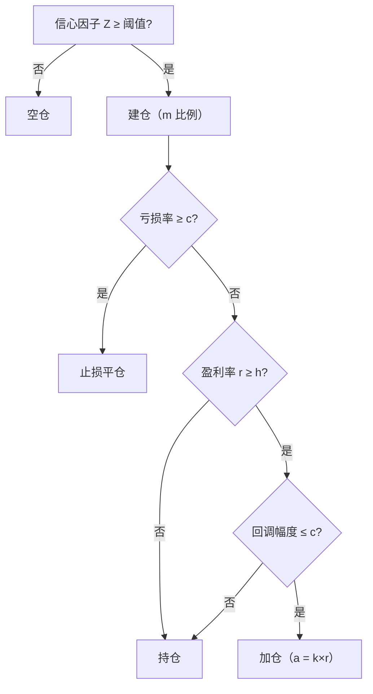

# 项目概述

基于 Python + AkShare 的 A 股量化投资系统，面向单人使用。

| 属性 | 说明 |
|------|------|
| 资金规模 | 1k – 100 万人民币 |
| 资产范围 | 沪深 A 股股票、公募基金（ETF、LOF、场外基金） |
| 交易频率 | 日线级（非高频） |
| 执行方式 | 仅输出建议，手动下单 |
| 核心策略 | Livermore 原则：**浮亏不加仓、盈利加仓** |
| 绩效指标 | 收益率、夏普比率、最大回撤、波动率、胜率 |
| 合规框架 | 遵守证监会及沪深交易所程序化交易规定 |

# 系统架构

各模块职责及数据流：



| 模块 | 职责 |
|------|------|
| 数据接入 | AkShare 拉取沪深 A 股日线行情及基金净值（ETF / LOF / 场外），覆盖**用户持仓 + 用户自选 +（可选）市场扫描候选**三类标的，支持重试与本地缓存 |
| 数据清洗 | 停牌填充、复权、异常值过滤、交易日对齐 |
| 因子计算 | MA/EMA/MACD/RSI/布林带/动量/量比，合成信心因子 Z |
| 策略决策 | Livermore 建仓 / 止损 / 加仓规则，输出交易信号 |
| 组合管理 | 多标的权重优化（等权 / 风险平价） |
| 回测引擎 | 模拟历史交易，计算净值曲线与绩效指标 |
| 结果输出 | 生成交易建议与绩效报告 |

# 技术选型

| 分类 | 选用方案 | 说明 |
|------|----------|------|
| 语言 | Python | 量化生态成熟（Pandas / NumPy / TA-Lib） |
| 数据接口 | AkShare | 免费、覆盖 A 股与基金，调用有频率限制 |
| 数据存储 | Parquet + YAML + JSONL | 行情缓存使用 Parquet，策略配置使用 YAML，审计日志按 JSONL 追加写入 |
| 机器学习 | Scikit-Learn / LightGBM | 辅助预测趋势，按需引入 |
| 容器化 | Docker | 保证环境一致性，支持 Cron 定时任务 |
| CI/CD | GitHub Actions | checkout → 安装依赖 → pytest → flake8 |
| 敏感配置 | 环境变量 | 凭证不入代码仓库 |

# 数据规范

**数据来源**：仅使用 AkShare 接口，覆盖沪深 A 股日线行情与公募基金净值（ETF、LOF、场外基金）。

**标的池来源**（三类取并集）：

| 来源 | 说明 | 配置位置 |
|------|------|----------|
| 独立荐股候选 | 优先读取本地离线候选池（股票/ETF/场外基金），再按高维聚类去同质化 + 帕累托支配过滤（个股）择优，仅输出 1 个代码 | `datas/recommend/candidate_pool.json` + `scripts/strategy/build_candidate_pool.py` + `scripts/strategy/recommend_one.py` |
| 用户持仓 | 当前实际持有的股票或基金，每日必须纳入计算 | `strategy_config.yaml` → `capital.holdings` |
| 用户自选 | 手动维护的关注列表，无论是否满足 Z 阈值均参与计算 | `strategy_config.yaml` → `capital.watchlist` |

**配置补充（当前实现）**：
- `capital.current_positions`：真实持仓明细（成本价、份额、峰值、资产类型）
- `capital.watchlist_metadata`：自选标的元信息（名称、资产类型），用于识别股票 / ETF / 场外基金
- `livermore.asset_params.stock` / `livermore.asset_params.etf` / `livermore.asset_params.fund_open`：股票、ETF/LOF、场外基金三套独立参数（m/c/h/k）
- `signal`：扫描与候选池参数（不再配置手工 Z 阈值）
- `signal.scan_etf_top_n` / `signal.scan_stock_top_n` / `signal.scan_fund_top_n` / `signal.scan_eval_days`：离线候选池择优参数
- `signal.recommend_exclude_symbols`：独立荐股排除代码列表（如不希望重复推荐某些代码）

**基金类型说明**：

| 类型 | 交易方式 | AkShare 接口 |
|------|----------|--------------|
| ETF | 场内实时撮合，使用日线行情价格 | `fund_etf_hist_em` |
| LOF | 场内可交易，亦可通过基金公司申赎 | `fund_lof_hist_em` |
| 场外基金 | 按日净值申购/赎回，T+1 确认 | `fund_open_fund_info_em` |

**清洗规则**：
- 停牌缺失：前值填充（ffill）
- 复权方式：前复权（qfq）
- 异常值：单日涨跌幅超过阈值的行标记后前填充
- 有效性：不足 60 个交易日的标的直接过滤

**回测费率模型**：

| 费用类型 | 数值 |
|----------|------|
| 股票佣金（双边） | 0.03% |
| 滑点 | 0.02% |
| 印花税（卖出） | 0.1% |
| 基金申购费 | 1.5% |

# Livermore 策略规则

**参数说明**：

| 参数 | 含义 | 配置键 |
|------|------|--------|
| *m* | 初始建仓比例（占总资金） | `livermore.asset_params.<asset_type>.m` |
| *c* | 止损 / 回调阈值 | `livermore.asset_params.<asset_type>.c` |
| *h* | 加仓解锁盈利阈值 | `livermore.asset_params.<asset_type>.h` |
| *k* | 加仓系数，$a = k \times r$ | `livermore.asset_params.<asset_type>.k` |
| *Z* | 入场动态阈值（由全市场 `confidence_z` 分位数生成） | 动态计算 |
| *Y* | 转仓强度因子（由全市场 `confidence_z` 聚合生成） | 动态计算 |

说明：不同资产类型使用不同的参数配置。`<asset_type>` 当前包含 `stock`（股票）、`etf`（ETF/LOF）与 `fund_open`（场外基金）。当前版本将调优重点收敛为 `m/c/h/k`，`Z/Y` 不再手工配置阈值，而由市场状态动态生成。

**决策流程**：



**资金不足时（Y 因子）**：
- 先由全市场信号（`confidence_z`）合成市场强度 $Y$
- 同时按市场强弱动态生成转仓触发线 `y_trigger`
- 当 $Y \ge y\_trigger$：卖出当前最差持仓 1 只进行转仓
- 当 $Y < y\_trigger$：不强制卖出补齐，仅使用当前现金（有多少用多少）

**同日卖出信号去重（当前实现）**：止损优先于 Y 因子卖出；若某标的当日已触发止损，不会再重复生成 Y 因子卖出信号。

**绩效指标**：回测核心关注以下四项指标，基准为沪深 300（000300）。

| 指标 | 定义 |
|------|------|
| 总收益率 | $(V_{end} - V_{start}) / V_{start}$ |
| 夏普比率 | $(R_{annualized} - R_f) / \sigma_{annualized}$ |
| 最大回撤 | 净值曲线峰值到谷值的最大跌幅 |
| 胜率 | 回测期间盈利平仓笔数 / 总平仓笔数，$W = N_{win} / N_{total}$ |

补充：若回测区间内没有任何卖出成交，胜率显示为 `N/A`（而不是 0），避免与“有亏损卖出且胜率为 0”混淆。

**参数优化目标（当前实现）**：
- 自动调优按资产类型分组独立执行（`stock`、`etf`、`fund_open` 各跑一套 m/c/h/k）
- 调优窗口固定为短周期：默认 `30,120` 交易日
- `--apply` 写回参数时优先使用 `120` 日窗口结果
- 每组只优化一个目标：已实现盈亏（`realized_pnl`）
- 评分函数：$score = realized\_pnl$

# 因子体系

| 类别 | 因子 |
|------|------|
| 均线 | MA(5/10/20/60)、EMA(12/26) |
| 趋势 | MACD(DIF/DEA/柱)、布林带(20,2σ) |
| 动量 | ROC、N 日收益率(5/10/20) |
| 量价 | 成交量均线、量比 |
| 综合 | 信心因子 Z（候选组件滚动标准化后合成） |

**指标质量控制（当前实现）**：
- 在合成 `confidence_z` 前，对候选组件做三维评估：预测性、稳定性、覆盖率
- 若某组件在三维上被其他组件彻底帕累托支配，则剔除
- 目标：避免低质量指标把噪声注入决策链

# 开发规范

**分支模型**：GitHub Flow — `main` 保持可部署，功能在 `feature/*` 分支开发，发布打 Tag。

**测试要求**：
- 单元测试（pytest）：覆盖因子计算、策略决策、回测逻辑的边界与异常情况
- 集成测试：用标准测试数据集做端到端回测验证
- 代码检查：flake8 静态检查，所有测试通过后方可合并

**可复现性**：固定随机种子，行情数据与参数纳入版本控制。

# 部署与运维

- **运行环境**：Docker 容器，每日收盘后 Cron 触发数据更新
- **监控**：记录每日回测损益、脚本异常，邮件 / 钉钉告警
- **合规**：全量审计日志（时间戳、信号类型、因子值、价格、金额），只追加写入，支持事后回溯

# 快速运行

以下命令均在项目根目录执行（Windows PowerShell）。
当前保留最小必需命令集合：`1`、`2`、`2.1`、荐股场内、仅个股荐股、荐基场外、历史回测报告非静默、三组全量参数调优并写回。

```powershell
# 1) 安装依赖（首次）
.\.venv\Scripts\python.exe -m pip install -r requirements.txt

# 2) 生成今日交易建议（仅持仓+自选）
.\.venv\Scripts\python.exe scripts\strategy\signal_generator.py

# 2.1) 构建离线候选池（建议每日先执行）
.\.venv\Scripts\python.exe scripts\strategy\build_candidate_pool.py

# 2.2) 独立荐股（始终设置超时，避免网络阻塞）
.\.venv\Scripts\python.exe scripts\strategy\recommend_one.py --timeout 90

# 2.2.1) 独立荐股（仅场内候选，含 ETF/LOF）
.\.venv\Scripts\python.exe scripts\strategy\recommend_one.py --timeout 90 --fund-top-n 0

# 2.2.1.1) 独立荐股（仅个股，不含 ETF/LOF/场外基金）
.\.venv\Scripts\python.exe scripts\strategy\recommend_one.py --timeout 90 --stock-only

# 2.2.2) 独立荐基（仅场外候选）
.\.venv\Scripts\python.exe scripts\strategy\recommend_one.py --timeout 90 --etf-top-n 0 --stock-top-n 0

# 3) 历史回测报告（非静默进度版，固定最近120交易日）
.\.venv\Scripts\python.exe scripts\backtest\run_backtest_report.py --show-progress --show-meta --trial-days 120

# 4) 双组全量参数调优并写回（默认窗口 30,120）
.\.venv\Scripts\python.exe scripts\backtest\auto_tune_params.py --window-days 30,120 --apply

# 4.1)时间放大到十年 
.\.venv\Scripts\python.exe scripts\backtest\auto_tune_params.py --window-days 2520 --apply  
```

运行结果说明：
- 独立荐股输出：`recommend_one.py` 优先从离线候选池读取候选，经过聚类去重、基金同类去重（同前5位代码）与帕累托过滤后仅输出 1 个推荐代码（若无候选则输出 `NONE`）；建议始终传 `--timeout`。仅当有有效推荐代码时才会追加到 `datas/recommend/荐股.txt`，格式为按天聚合（如 `2026-03-13：022364、022365`）。独立荐股会自动排除“当日已推荐过”的代码（场内/场外统一生效）
- 参数语义补充：`--fund-top-n 0` 仅禁用场外基金，不会禁用 LOF；因为 LOF 当前与 ETF 一样归入场内候选。若只想从个股中推荐，请使用 `--stock-only`
- 建议输出：`signal_generator.py` 输出持仓交易建议
- 回测输出：结束日自动取最近交易日；历史回测固定在最近 120 个交易日（脚本内硬限制，命令中也建议显式传 `--trial-days 120`）；除组合总指标外，还会输出每个代码的单标的收益率/夏普，以及按组合成交记录统计的分代码胜率（赢/平仓）与已实现盈亏
- 调优输出：默认会分别对 `stock`、`etf` 与 `fund_open` 三组在 `30/120` 交易日窗口进行网格搜索；可用 `--max-cases` 限制每组运行组数、`--workers` 控制并发（Windows 建议先用 `--workers 1`）；`--apply` 优先写回 120 日窗口的分组最优 `m/c/h/k`

# 合规要点

遵守证监会及沪深交易所量化交易规定，系统自动检测以下异常并发出警告：
- 单日建议频率过高
- 单标的资金集中度超限

# 里程碑

| # | 阶段 | 交付物 | 验收标准 |
|---|------|--------|----------|
| 1 | 需求与设计 | 系统设计文档 | 设计评审通过 |
| 2 | 数据与环境 | 清洗脚本、回测环境配置 | 示例数据成功清洗并可回测 |
| 3 | 核心策略 | Livermore 策略代码 | 历史回测符合预期收益/风险指标 |
| 4 | 辅助模型与优化 | 组合优化模块 | 回测结果优于基准 |
| 5 | 测试与 CI | 单元/集成测试、CI 配置 | 全部测试通过，流程自动化 |
| 6 | 文档与部署 | 用户手册、部署指南 | 系统稳定运行，无未文档功能 |

# 附录

## 目录结构

```
QMT_A6/
├── docs/               # 文档
├── configs/            # 配置文件（data_config.yaml、strategy_config.yaml）
├── datas/raw/          # 原始行情数据缓存
├── scripts/
│   ├── processed/      # 数据获取与清洗（fetch_data.py、clean_data.py）
│   ├── features/       # 因子计算（calc_features.py）
│   ├── strategy/       # 策略决策（livermore.py、signal_generator.py）
│   ├── backtest/       # 回测引擎
│   ├── portfolio/      # 组合优化
│   └── utils/          # 通用工具（asset_loader.py、market_scanner.py、audit_logger.py）
└── tests/
    ├── unit/           # 单元测试
    └── integration/    # 集成测试
```

## 关键接口

```python
# 数据层
fetch_stock_price(symbol, start_date, end_date, adjust="qfq") -> DataFrame
fetch_fund_nav(fund_code, start_date, end_date) -> DataFrame
fetch_trade_calendar(start_date, end_date) -> list[str]
get_latest_trade_date(ref_date=None) -> str

# 因子层
build_all_features(df) -> DataFrame  # 追加所有因子列

# 策略层
LivermoreStrategy().generate_signals(portfolio, prices, confidence_scores, asset_types=None) -> list[dict]
get_latest_signals(portfolio, start_date, symbols=None, signal_date=None) -> list[dict]

# 市场扫描层
recommend_best_candidate(exclude_symbols=None, etf_top_n=8, stock_top_n=8, fund_top_n=16, eval_days=365, strategy_params=None, risk_free_rate=0.02, disable_proxy=False) -> dict | None

# 回测层
prepare_backtest_context(symbols, start_date, end_date, asset_meta_override=None) -> dict

run_backtest_from_prepared(prepared_context, capital, risk_free_rate=0.02, strategy_params=None) -> {
    "equity_curve": pd.Series,
    "metrics": dict,
    "trade_log": list[dict],
}

run_backtest(symbols, capital, start_date, end_date, risk_free_rate=0.02, strategy_params=None, asset_meta_override=None) -> {
    "equity_curve": pd.Series,        # 每日净值曲线
    "metrics": {                       # 绩效指标
        "total_return": float,
        "sharpe_ratio": float,
        "max_drawdown": float,
        "win_rate": float | None,      # 无卖出时为 None（展示层显示 N/A）
    },
    "trade_log": list[dict],           # 逐笔交易记录
}
```

## 参考链接

**合规**
- [上海证券交易所（SSE）](http://www.sse.com.cn)
- [深圳证券交易所（SZSE）](http://www.szse.cn)

**数据接口**
- [AkShare](https://akshare.akfamily.xyz) — 本系统指定数据接口

**Python 库**
- [Pandas](https://pandas.pydata.org)
- [NumPy](https://numpy.org)
- [Scikit-Learn](https://scikit-learn.org)
- [LightGBM](https://lightgbm.readthedocs.io)

**DevOps**
- [GitHub Actions](https://docs.github.com/actions)
- [Docker](https://www.docker.com)

**金融理论**
- [Sharpe Ratio（夏普比率）](https://en.wikipedia.org/wiki/Sharpe_ratio)
- [Modern Portfolio Theory（马科维茨组合理论）](https://en.wikipedia.org/wiki/Modern_portfolio_theory)
- [Risk Parity（风险平价）](https://en.wikipedia.org/wiki/Risk_parity)
